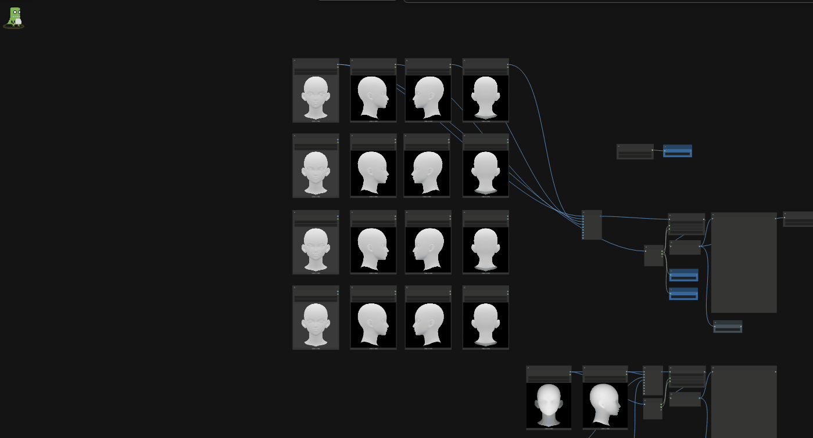
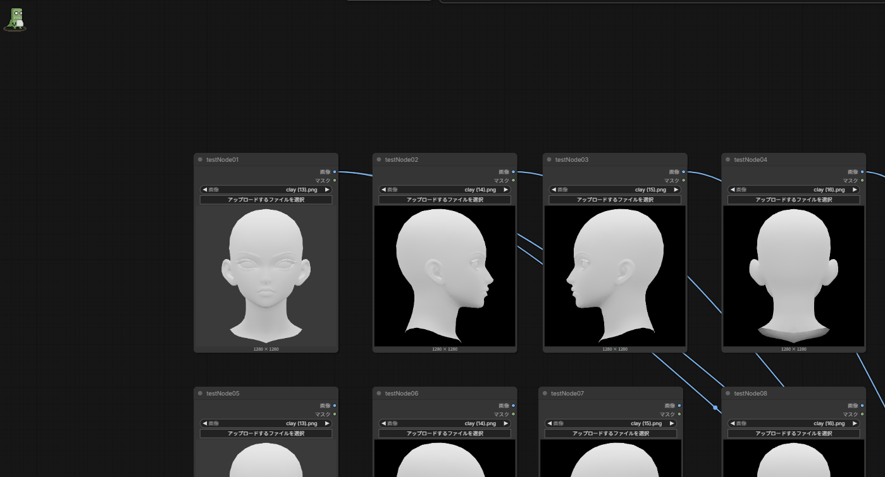
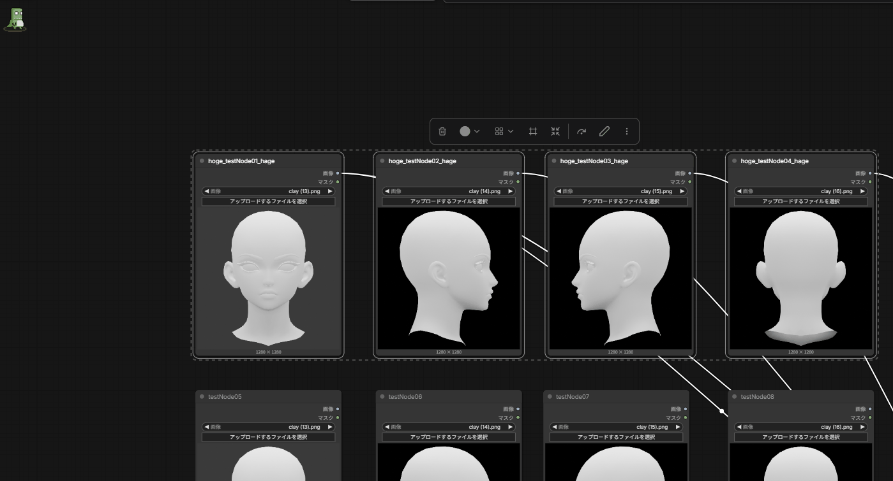
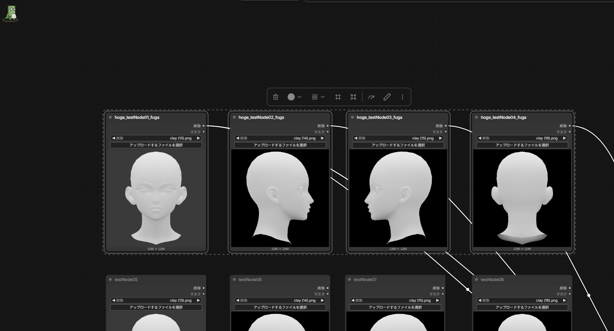

# ComfyUI-NodeRenamer

Frontend-only batch rename utility for ComfyUI nodes.

## Features

- Rename selected nodes as `BaseName + incrementing index`
- Increment order is **selection order**
- Numeric `Padding`
  - Padding `0` -> `1, 2, 3...`
  - Padding `2` -> `001, 002, 003...`
  - Padding `5` -> `000001, 000002, 000003...`

  
- Prefix / Suffix
  

- Find / Replace, optionally case-sensitive
  

- Case conversion
  - `snake_case`
  - `camelCase`
  - `PascalCase`
  

- Preview before applying
- Undo last rename (up to 20 operations in the current browser session)

## Install

Copy this folder into:

`ComfyUI/custom_nodes/ComfyUI-NodeRenamer`

Then restart ComfyUI and reload the browser page.

## Usage

1. Select nodes in the desired order.
2. Open **Node Renamer** from the selection toolbox or top menu.
3. Choose the operation and preview the result.
4. Click **Apply**.

## Notes

This extension changes only the visible node title (`node.title`). It does not alter node type, inputs, outputs, widgets, or backend execution behavior.

Selection order is tracked when nodes transition into the selected state. If another extension creates a multi-selection without emitting normal node selection callbacks, Node Renamer falls back to ComfyUI's current selected-node enumeration for those nodes.
